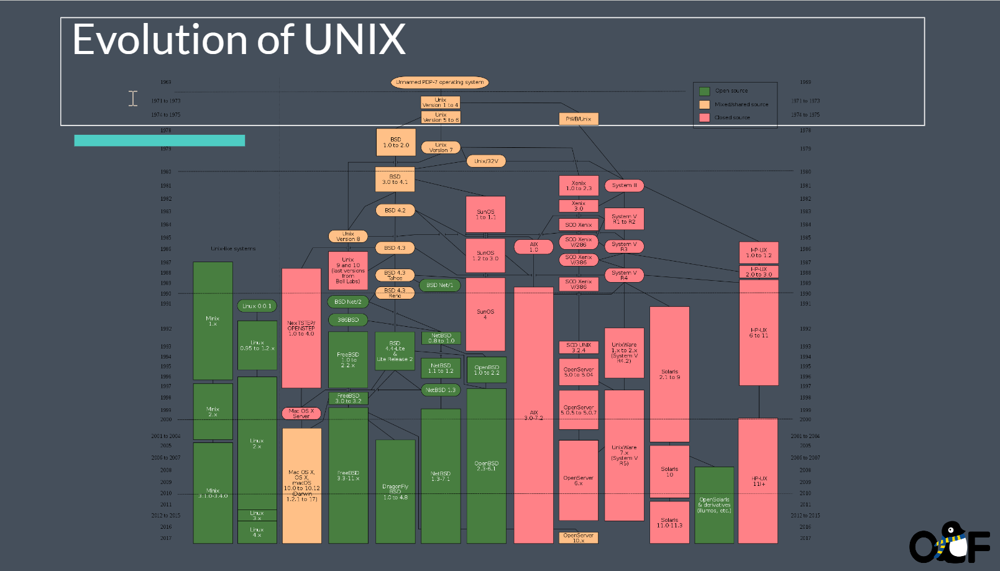
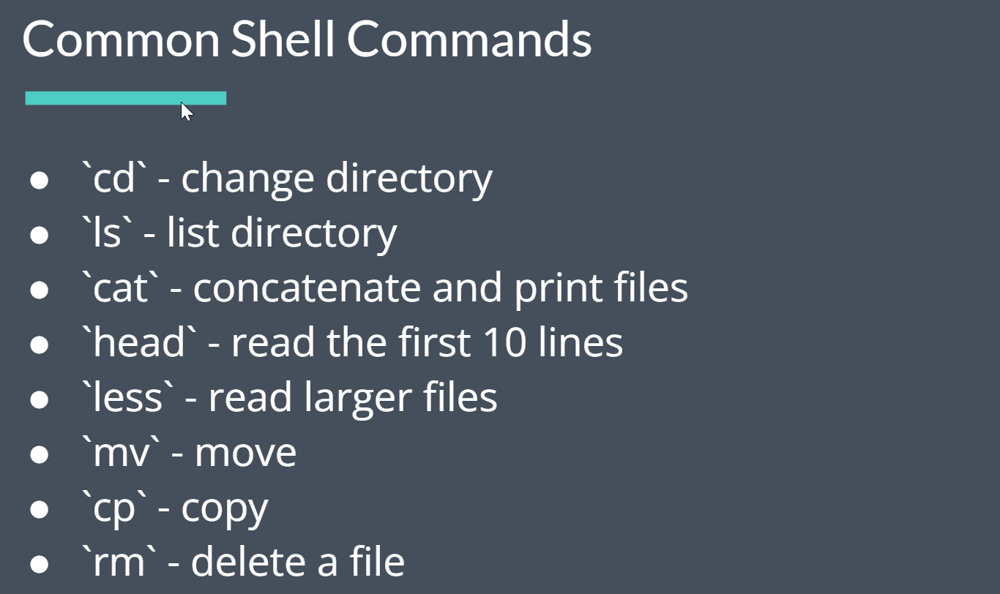
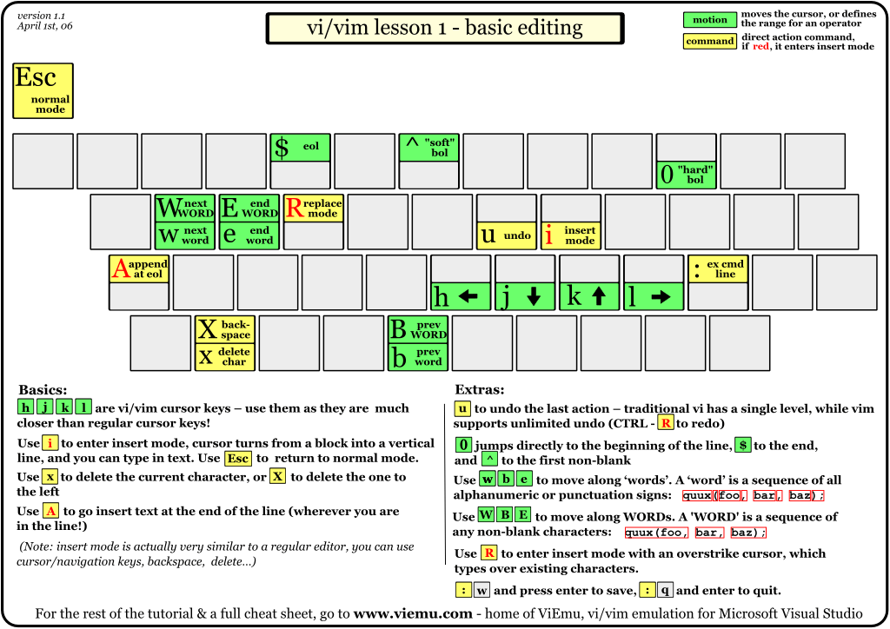

<div class="middle center">
<div style="width: 100%">


# Lec1 Linux 环境和 Shell 基础

<hr/>

2023fall 计算机学院朋辈辅学「实用工具拾遗」课程


<div style="text-align: right; margin-top: 1em;">
<p>2023.10.14&emsp;&emsp;&emsp;</p>
</div>

</div>
</div>

<!--v-->

## 本节内容

- 清楚认识什么是 Shell，什么是 Terminal
- 学会 Shell 基础命令，包括目录操作、文本编辑、重定向、管道等
- 了解 vim 编辑器的基本用法，以及如何自行学习

<!--s-->

<div class="middle center">
<div style="width: 100%">

# Part.1 内核、终端&shell？

</div>
</div>

<!--v-->

## 什么是 Shell

- 一个黑黑的窗口？
- 一个输入奇怪命令的地方？
- 一个看起来很高级很黑客的界面？

<div class="fragment">

❌ 这些都不是 Shell ❌

</div>


<div class="fragment">

这些描述的窗口其实是 Terminal

</div>

<!--v-->

## 什么是 Terminal
<div class="fragment">

- 也叫 Terminal Emulator，模拟传统终端的行为
- 一个应用程序，提供了一个窗口，和输入输出交互的功能
- 内部运行的是 Shell，Shell 才是执行命令得到输出的东西

</div>

<div class="fragment">

都有哪些常用的 Terminal 呢？

</div>

<div class="fragment">

- Windows 下：Windows Terminal（强烈推荐）
- Linux 下：Gnome Terminal、Konsole、iTerm2 等
- macOS 下：原生 Terminal、iTerm2（推荐）等
- 跨平台：
    - Warp: <https://warp.dev/>，基于 Rust
    - Hyper: <https://hyper.is/>，基于 Electron
    - ...

</div>

<!--v-->

## 那什么才是 Shell
<div class="fragment">

**Shell is a command line-interface (CLI) to interact with the computer.**

</div>

<div class = "fragment">

- “壳层”，是用户与系统内核交互的界面
- 也是一个程序，负责接收命令，处理要做的工作然后交给内核来执行，并处理返回输出
- 如何让内核执行工作？系统调用

</div>

<div class="fragment">

都有什么常用的 Shell 呢？

</div>  

<div class="fragment">

- Windows 下：cmd.exe、PowerShell（图形化 Shell）
- *nix 下：
    - **sh**：Bourne Shell，最早、最经典的 shell
    - **bash**：Bourne Again Shell，最常用的 shell，绝大部分 Linux 发行版的默认 shell
    - **zsh**：Z Shell，功能强大、可高度自定义的 shell（个人推荐）
        - 自 macOS Catalina 开始的默认 shell
    - **fish**：Friendly Interactive Shell，易用、全平台的 shell

</div>

<!--v-->

## Shell 与 Terminal

- Terminal 的任务是从用户获取输入，然后传递给 Shell，等待 Shell 执行完后，将结果再传递回用户（显示出来）
- Shell 的任务是从 Terminal 拿到输入指令，解析后交给内核执行，然后将结果返回给 Terminal

一些例子：

- macOS 下 Terminal 可以随意更换 Shell
- Ctrl-C 到底是复制还是中断程序？
    - 和 Shell 无关，是 Terminal 的行为
    - 比如 macOS 上 iTerm 就可以随意更改按键的这些行为
    - 如果定义了 ^C 应该复制，那么 Terminal 就会直接复制内容到剪贴板
    - 如果定义了 ^C 应该中断程序，那么 Terminal 就告诉 Shell，Shell 再通过 SIGINT 信号通知内核中断程序

<!--v-->

## 为什么要用命令行？它能做什么？

- 命令行就是一种操作计算机的方式，理论上可以做任何事情
- 可以让你手在键盘上就能控制电脑，而不需要鼠标拖拽等
- 在没有显示器的服务器上（例如通过 ssh 连接），只能通过命令行操作
`ssh dzz@clusters.zju.edu.cn -p 80`

一个夸张的例子：你甚至可以在命令行中查看网页！(来让我们看看bilibili页面长什么样吧)

<div style="text-align: center;">

</div>

<!--v-->

## *关于 zsh 的一些推荐配置

- oh-my-zsh：<https://ohmyz.sh/>，一个 zsh 的配置框架，支持主题、插件等配置
- powerlevel10k（p10k）：一个 oh-my-zsh 的主题，配置简单，好看
- 插件：
    - git：oh-my-zsh 自带插件，提供 git 相关的提示
    - zsh-autosuggestions：自动提示输入过的历史命令
    - zsh-syntax-highlighting：命令语法高亮
    - autojump：快速跳转到曾经跳转过的目录
    - ...

具体安装方法等请见：<https://note.tonycrane.cc/cs/tools/shell/>
<!--s-->

<div class="middle center">
<div style="width: 100%">

# Part.2 Linux介绍以及配制

以 wsl 为例

</div>
</div>

<!--v-->

## Unix历史
<div style="text-align: center;">
    
</div>

<!--v-->

## Open Source Software (OSS)

- Free and Open Source Software (FOSS) or Free/Libre Open Source Software (F/LOSS)
- “Free as in beer, and free as in freedom”
- Open source software - term used by some software and technology companies. You may not have the right to use, modify, or redistribute the software or source code

<!--v-->
## GNU and the Free Software Movement


<div class = "fragment">
“So that I can continue to use computers without violating my principles, I have decided to put together a sufficient body of free software so that I will be able to get along without any software that is not free.”
Richard Stallman (1983)（懂得都懂是吧hhhh）
</div>

<!--v-->

## 常见的使用环境
- 虚拟机（例如virtualbox，VMware Workstation推荐）
- windwos用户强烈建议大家使用`WSL`

<div class = "fragment">

关于WSL中使用的一些推荐：
- 安装教程可以见 [官方文档](https://learn.microsoft.com/en-us/windows/wsl/install)(建议最好是专业版，家庭版需要开启HyperV服务)
- [Dev on WSL](https://dowww.spencerwoo.com/)(一个WSL使用技巧的网站)

</div>

<!--v-->

## 常用的shell命令

命令千千万，但是最常用同时也让你快速上手linux命令就那么几个

<div class="fragment">
    <div style="text-align: center;">
    
    </div>
</div>


<!--s-->

<div class="middle center">
<div style="width: 100%">

# Part.3 基础 Shell 命令

以 bash/zsh 为例

</div>
</div>

<!--v-->

## 如何学习
- [Decal slide](https://docs.google.com/presentation/d/1SYoC8j1qiM4CuhSArouJbhLpUfDAfyuFMF8r7R4Y0_Y/edit#slide=id.g1f06a453932_1_32)
- Missing semester
- Of course Google!

<!--v-->

## Prompt 与路径意识

- Prompt 即命令提示符，用来等待输入并给你提供一些信息
- 其中最重要的信息就是**当前路径**，也称工作路径，是当前 Shell 所处的“位置”
    - 一定要时时刻刻知道自己“在哪里”
    - 因为基本所有命令的行为都和当前路径有关
- 通常还要有的信息是当前正在操作的**用户**
    - 和权限有关，比如普通用户还是 root 等

<br/>

<div class="fragment">

- 向其中输入命令然后回车，就可以执行命令
- 输入 pwd，这个命令用来获取当前路径
    - 可见 ~ 代表的就是当前用户的 “home” 目录
- *nix 下的路径分隔符是 /，Windows 下是 \
- 而且 Windows 下有多个“根目录”，即不同“盘符”，比如 C:\、D:\ 等

</div>

<!--v-->

## 路径相关命令

- pwd：获取当前路径
- cd *path*：切换路径
    - *path* 可以是“相对路径”或者“绝对路径”
    - *path* 中 ~ 代表 home，. 代表当前路径，.. 代表上一级路径

<!--v-->

## 文件/目录操作命令

- ls：列出当前路径下的文件和目录
    - -a：列出所有文件和目录，包括隐藏文件
    - -l：列出详细信息
- touch *file*：创建一个文件
- mkdir *dir*：创建一个目录
- rm *file*：删除一个文件
    - -r：递归删除目录；-f：强制删除
- rmdir *dir*：删除一个空目录（rm -r *dir* 删除目录及其下全部内容）
- cp *src* *dst*：复制文件或目录
    - -r：递归复制目录
- mv *src* *dst*：移动文件或目录（重命名）
- find *path* -name *pattern*：在 *path* 下查找文件名匹配 *pattern* 的文件

<!--v-->

## 文件内容查看命令

- cat *file*：输出文件内容
    - -n：输出行号
- head -n *lines* *file*：输出文件前 *lines* 行
- tail -n *lines* *file*：输出文件后 *lines* 行
- more/less *file*：分页输出文件内容
    - 空格翻页，回车下一行，q 退出
    - less 的功能更多，比如查找，更好的翻页等，用法见 less --help

<!--v-->

## 其他命令

- echo：输出字符串（常配合重定向/管道使用）
- whoami：获取当前用户
- date：获取当前时间
- clear：清屏
- ps：显示进程信息
- kill：杀死进程
- man：查看 man 文档
- grep：查找文件内容（常配合重定向/管道使用）
- diff：比较文件/目录内容
- ln：创建链接
- whereis/which：查找命令所在位置
- curl：发送 HTTP 请求；wget：下载文件
- ...

<!--v-->

## 重定向

- 即文件流重定向
- shell 中三种流：stdin 标准输入，stdout 标准输出，stderr 标准错误
- 如何更便捷地将输出存入文件/将文件内容作为程序输入？通过重定向
- 通过 > *file* 将 stdout 重定向到文件，通过 < *file* 将文件重定向到 stdin
- 通过 2> *file* 将 stderr 重定向到文件
- 两个右箭头（大于号）>> 表示追加模式，即不覆盖原文件，而是追加到文件末尾
- 通过 &> *file* 将 stdout 和 stderr 重定向到文件

<div class="fragment">

常见用法：

- echo "hello" > *file*：将字符串 hello 写入文件
- cat *file* > *file2*：将文件内容复制到另一个文件
- diff *file1* *file2* > *file3*：将 diff 的输出写入文件
- ./a.out < *file*：将文件作为程序的输入

</div>

<!--v-->

## 管道

- 通过管道（pipe）可以将一个命令的输出作为另一个命令的输入
- 使用 | 操作符，将左侧 stdout 重定向到右侧 stdin
- 通过管道可以将多个命令连接起来，形成一个命令序列，可以通过一行命令来完成相对复杂的操作（e.g. [SadServers](https://sadservers.com/) Saskatoon）
    ```bash
    $ cat /home/admin/access.log | cut -d ' ' -f 1 | sort | uniq -c | sort | tail -n 1
    ```
- 复杂命令看不懂？推荐：[explainshell](https://explainshell.com/)

常用搭配：

- *some command* | tail -n *lines*：只输出最后 *lines* 行
- *some command* | less：分页输出
- *some command* | grep *pattern*：在输出中查找匹配 *pattern* 的行
- 与 cut / sort / uniq / awk 等命令搭配，处理文本数据
- ...

<!--v-->

## *环境变量

- 一些记录了系统信息的变量，方便程序来使用
- 通过 echo $*var* 来查看某一环境变量的值，env 命令查看所有环境变量
- 一个关于环境变量和 shell 命令执行的例子
    - 🤔 命令是什么（例如 ls）？
    - -> 是一个程序（/bin/ls），执行命令就是执行程序
    - 🤔 为什么 shell 可以只通过 ls 就找到 /bin/ls 这个可执行文件？
    - -> 在 PATH 环境变量中查找
    - 🤔 为什么一定要用 ./a.out 而不是 a.out 来执行程序？
    - -> 因为 .（即当前目录）并不在 PATH 变量中
- 设置环境变量
    - export *var*=*value*：设置环境变量
        - 仅在当前执行的 shell 中有效，如何持久化 -> 写入配置文件
    - unset *var*：删除环境变量，或通过 export 将值设为空

<!--v-->

## *配置文件

- 本质上是在加载 shell 时执行的一些脚本文件
    - 比如 Linux 上 bash 在启动时会依此加载并执行以下文件（有省略）：
        - /etc/environment -> /etc/profile -> ~/.profile -> ~/.bashrc
    - 所以只要将 export 语句写入上述中的一个（一般是 ~/.bashrc）就可以自动对所有 shell 设置环境变量
- 设置了 shell 的配置文件后，重开新 shell 才会有效果
    - 不想重开？可以使用 source *file* 来立刻加载某一配置文件
        - 其实就相当于直接运行了一下这个文件中的脚本
- 除了 shell 的配置文件外，其他程序的配置文件也经常存放在 home 下
    - 且通常以 . 开头（隐藏），以 rc 结尾（run command）
    - 比如后面会说到的 ~/.vimrc

<!--s-->

<div class="middle center">
<div style="width: 100%">

# Part.4 vim 基础用法

</div>
</div>

<!--v-->

## 什么是 vim？

- vi 和 vim？
    - vi: 大部分 *nix 系统自带的老牌文本编辑器
    - vim: vi improved，vi 的升级版，功能更强大
- 基于命令行的文本/代码编辑器
- 如何在你的电脑上使用 vim
    - Linux/macOS：直接通过包管理器（apt/yum/brew 等）安装
    - Windows：
        - 使用 WSL，里面安装 vim
        - 使用 [Gvim](https://www.vim.org/download.php) 或 [neovim](https://neovim.io/)（可配置）
    - VSCode 的 [vim 插件](https://marketplace.visualstudio.com/items?itemName=vscodevim.vim)也是一个选择。（但个人不建议新手这样做）
    - neovim：全平台的 vim 升级版，可配合 [LunarVim](https://www.lunarvim.org/) 开箱即用

<!--v-->
## 如何学习

> 自己本人大一苦苦挣扎于此类技能的学习，感慨与佬们差距的同时，你也会逐渐发现，听课不一定能让你学会东西。真正让你产生进步的一定是你的需求。

<div class="fragment">

> 因此个人建议是，等碰到不会的时候再去查。只有你有需求且熟练融入你的生活后你才能掌握它。

</div>

**Tips：**
- 当你不会的时候，Google是一个不错的选择。
- 一个Vim的小[游戏](https://vim-adventures.com/)，让你边玩边学.

时间关系后面的不一定全部讲完，大家可以自行学习，也希望我们可以多多交流一起进步。

<!--v-->

## 模式

- vim 中有多种模式，可以让你只通过键盘就完成各种操作
- 常用模式：
    - Normal 模式：默认模式，用于移动光标、处理文本、执行命令等
    - Insert 模式：用于输入文本
    - Command 模式：用于执行命令
    - *Visual 模式：用于选择文本

<div style="text-align: center; margin-top: 0.5em;">

</div>


<!--v-->

## Cheat Sheet

- From [vimcheatsheet.com](https://vimcheatsheet.com/)

<div style="text-align: center; margin-top: 0.5em;">

</div>

<!--v-->

## Cheat Sheet

- From [ViEmu](http://www.viemu.com/a_vi_vim_graphical_cheat_sheet_tutorial.html)

<div style="text-align: center; margin-top: 0.5em;">

</div>

<!--v-->

## vim 基础操作

- 同系列更多教程图片见 [ViEmu](http://www.viemu.com/a_vi_vim_graphical_cheat_sheet_tutorial.html)

<div style="text-align: center; margin-top: 0.5em;">

</div>

<!--v-->

## *vim 配置文件

- 通过 ~/.vimrc 文件来进行配置
- 我个人的几条简单配置：
    ```text
    syntax on
    set expandtab
    set number
    set autoindent
    set smartindent
    set tabstop=4
    set shiftwidth=4
    set softtabstop=4
    set laststatus=2
    set mouse=a
    set scrolloff=4
    inoremap { {}<ESC>i
    inoremap {<CR> {<CR>}<ESC>O
    ```

<!--v-->

## vim 学习资源

- 🏆 vim 自带教程：vimtutor（直接输入命令）
- [Vim Adventures](https://vim-adventures.com/)：一个游戏，通过游戏的方式学习 vim
    - PS: 这个是 copilot 非要给我加的（x
- Cheat Sheets:
    - [vimcheatsheet.com](https://vimcheatsheet.com/)
    - [ViEmu](http://www.viemu.com/a_vi_vim_graphical_cheat_sheet_tutorial.html)
    - [vim.rtorr.com](https://vim.rtorr.com/lang/zh_cn) 在线文字版
- Vim 从入门到精通：[wsdjeg/vim-galore-zh_cn](https://github.com/wsdjeg/vim-galore-zh_cn)

<br/>

<!--s-->

<div class="middle center">
<div style="width: 100%">

# 谢谢大家

<hr/>

**Questions?**

</div>
</div>